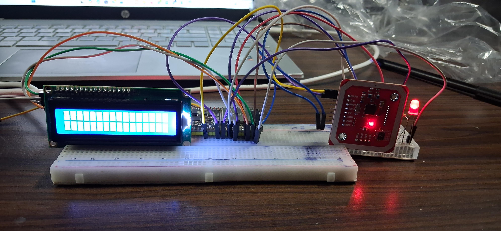
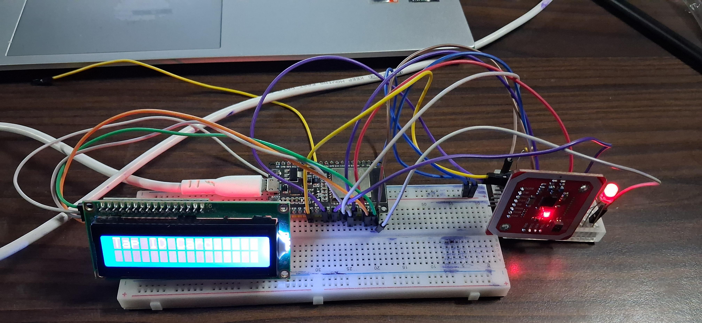
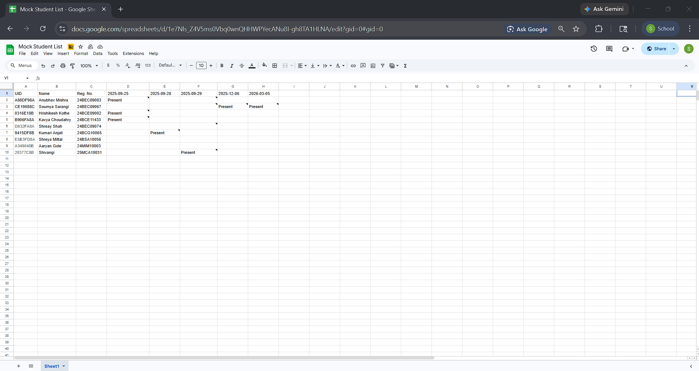

# NFC Smart Attendance System using ESP32


An IoT-based smart attendance system using ESP32 and PN532 NFC module with real-time Google Sheets attendance logging.

---

## Overview

The NFC Smart Attendance System is designed to automate attendance recording using NFC-enabled student ID cards.

The system uses an ESP32 microcontroller along with a PN532 NFC module to detect NFC cards embedded in student ID cards. When a student taps their card near the reader, the ESP32 reads the unique UID and automatically marks attendance.

The attendance data is updated in real-time to Google Sheets using WiFi connectivity, making the system efficient, contactless, and cloud-enabled.

---

## Features

- Contactless NFC-based attendance system
- Real-time attendance logging
- Google Sheets cloud integration
- ESP32 WiFi connectivity
- Fast NFC card scanning
- LCD display for attendance status
- LED and buzzer feedback indication
- Secure UID-based student identification
- Automated attendance management
- IoT-enabled smart monitoring system

---

## Hardware Components

- ESP32
- PN532 NFC Module
- I2C LCD Display
- Red LED
- Buzzer
- Breadboard
- Jumper Wires
- NFC-enabled Student ID Cards

---

## Technologies Used

- Embedded Systems
- Internet of Things (IoT)
- NFC Communication
- WiFi Networking
- Google Sheets API
- Arduino IDE

---

## System Workflow

NFC Card → PN532 Reader → ESP32 Processing → LCD Display → Google Sheets Update

---

## Working Principle

1. Student taps NFC ID card near the PN532 reader.
2. PN532 reads the unique NFC card UID.
3. ESP32 processes and verifies the UID.
4. Attendance status is displayed on the LCD screen.
5. LED and buzzer provide user feedback.
6. Attendance data is updated to Google Sheets through WiFi.

---

## Project Images

### Hardware Setup


### NFC Card Scanning


### LCD Attendance Display


### Google Sheets Attendance Logging


---

## Demo Video

🎥 Watch Full Project Demonstration Here:  
https://drive.google.com/drive/folders/1gvkyzoMu4XFRcDnWOnLlBFmiznTZaqVn?usp=sharing

---

## Applications

- Smart classroom attendance systems
- Office employee attendance systems
- Automated access control
- Secure entry management
- IoT-based monitoring systems

---

## Project Structure

```bash
NFC-Smart-Attendance-System/
│── images/
│── demo/
│── nfc_attendance_ESP32.ino
│── wiring.md
│── README.md
```

---

## Future Improvements

- Web dashboard for attendance analytics
- Mobile application integration
- Firebase database integration
- Admin panel for attendance management
- Face recognition backup authentication
- Email and SMS attendance notifications
- Cloud database synchronization
- RFID and biometric hybrid authentication
- Real-time attendance statistics and analytics
- Multi-class and multi-user support
- Attendance report generation in PDF/Excel format

---

## Author

**Soumya Sarangi**

---
